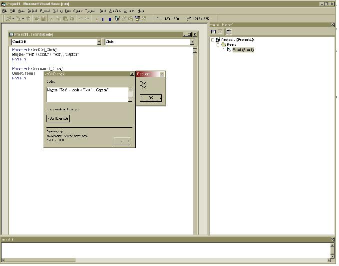



## vbCrlf

### Description

In a Msgbox, have you ever wanted to go to the next line without pressing the space bar for 10 minutes, there is an easier way to to it, i know most people propably know that you can use something called "vbCrlf" i have included a zip file which gives an example. here is another one

Msgbox "Your Text" + vbcrlf + "your Text",,"Caption"

you can also download the app which comes with it.

There are lots of other ways to do it. you can use "vblf" instead or "vbcr".

if you want to find them all out highlight vbcrlf in your code then right click on it and go to "Defenition" click that and you will get a listing of all the names you can use. or you can make your own name by declaring the name as a global in a module, but thats more advanced.

Please vote and leave comments(votes GREATLY appreiated)
 
### More Info
 

             |
---                |---
**Submitted On**   |2002-07-01 08:40:52
**By**             |[CJS](https://github.com/Planet-Source-Code/PSCIndex/blob/master/ByAuthor/cjs.md)
**Level**          |Beginner
**User Rating**    |3.6 (43 globes from 12 users)
**Compatibility**  |VB 6\.0
**Category**       |[Coding Standards](https://github.com/Planet-Source-Code/PSCIndex/blob/master/ByCategory/coding-standards__1-43.md)
**World**          |[Visual Basic](https://github.com/Planet-Source-Code/PSCIndex/blob/master/ByWorld/visual-basic.md)
**Archive File**   |[vbCrlf100569712002\.zip](https://github.com/Planet-Source-Code/cjs-vbcrlf__1-36433/archive/master.zip)

